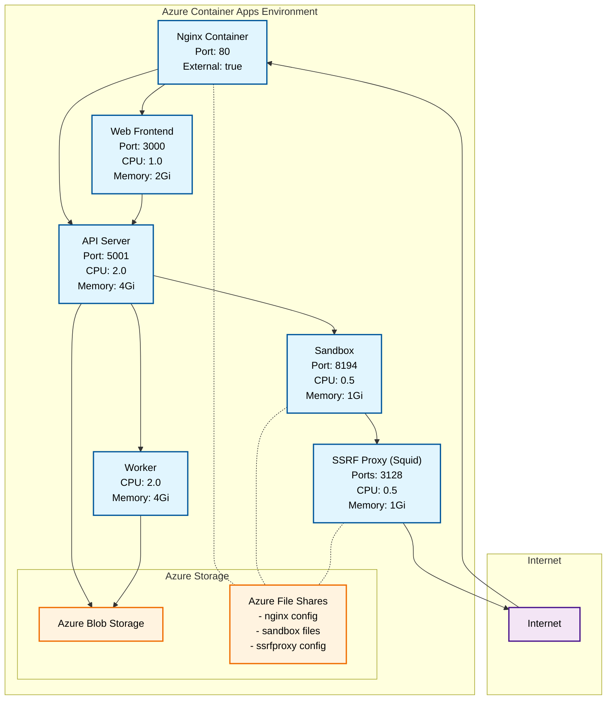

# cdktf-dify-on-azure

個人学習目的で、[dify Azure terraform](https://github.com/nikawang/dify-azure-terraform)を cdktf で書き直してみたものです。

## Azure

### コンポーネント構成

1. **Virtual Network**

   - ACA Subnet (10.0.16.0/20): Azure Container Apps の実行環境
   - Private Link Subnet (10.0.1.0/24): Private Endpoint の配置用
   - PostgreSQL Subnet (10.0.2.0/24): PostgreSQL サーバーの配置用

2. **Azure Container Apps**

   - Nginx: リバースプロキシ
   - Web: フロントエンド
   - API: バックエンド
   - Worker: 非同期処理用ワーカー
   - Sandbox: ユーザーのコード実行環境
   - SSRF Proxy: プロキシサービス

3. **データストア**

   - PostgreSQL Flexible Server: メインデータベース（PgVector 拡張機能付き）
   - Azure Cache for Redis: キャッシュおよびメッセージブローカー
   - Storage Account: ファイル保存, ファイル共有(マウント)

4. **監視**

   - Log Analytics: コンテナアプリのログ収集と分析

5. **Azure Key Vault**

   - シークレット管理 (PostgreSQL のパスワード)

6. **各コンポーネントの関係性**



## デプロイ

install packages

```bash
npm ci
```

azure login

```bash
az login
```

export environment variables

```bash
export AZURE_SUBSCRIPTION_ID=xxxx-xxxx-xxxx-xxxx
export PROJECT_NAME=cdktfdify
export POSTGRES_ADMIN_USER=<admin_user>
export POSTGRES_PASSWORD=xxxxxxxx
```

deploy

```bash
npx cdktf deploy
```

## 概算費用

### 月額費用概算

| コンポーネント    | スペック              | 基本料金 |
| ----------------- | --------------------- | -------- |
| PostgreSQL        | B_Standard_B1ms, 32GB | $23.40   |
| Redis Cache       | Basic_C0 x 1          | $16.06   |
| Private Endpoint  | 1 endpoint            | $7.30    |
| Private DNS Zones | 2 zones               | $1.00    |

上記 + 以下：

- Container Apps の課金
- Storage Account（ストレージ容量、操作回数）
- Log Analytics（ログデータ取り込み、クエリ実行、アーカイブ）
- File Shares（データ保存、スナップショット、操作回数）

```bash
# infra cost login
infracost auth login

# synth cdktf
npx cdktf synth

# infra cost breakdown
infracost breakdown --path cdktf.out/stacks/cdktf-on-azure/
```
